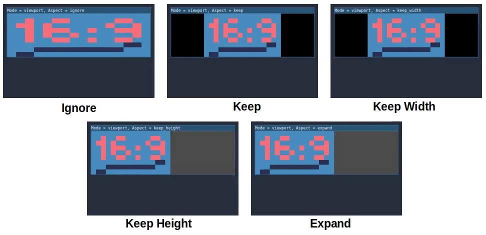
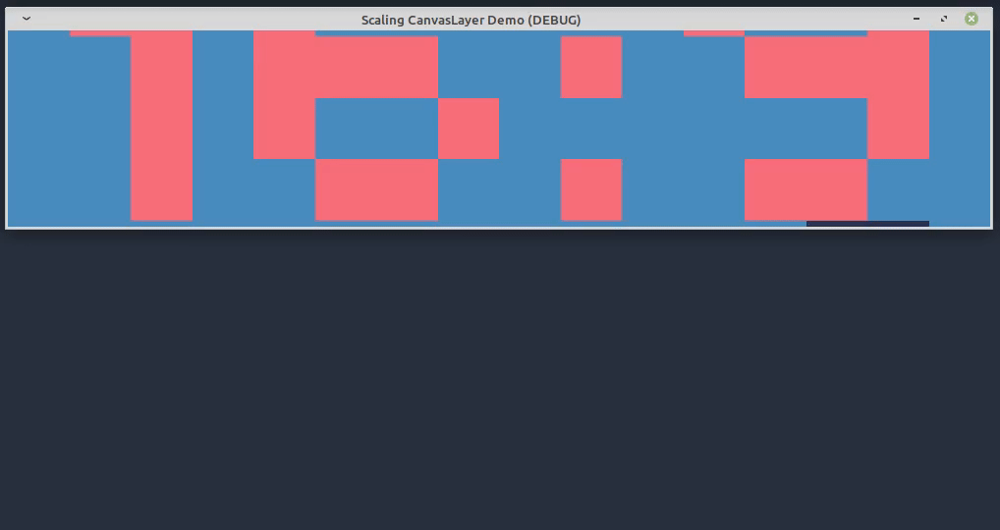
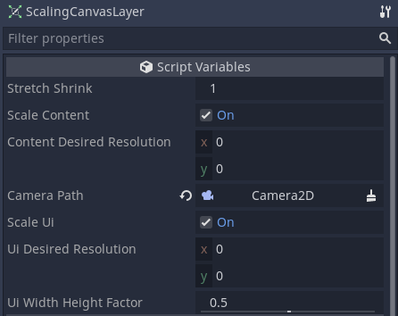
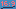
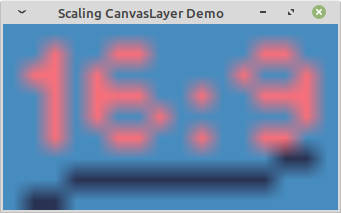
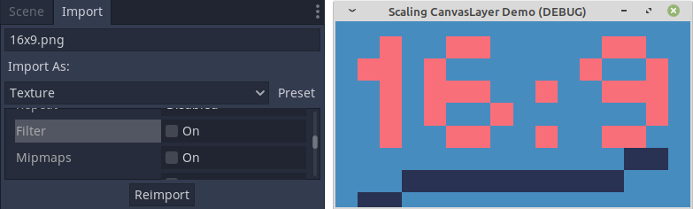
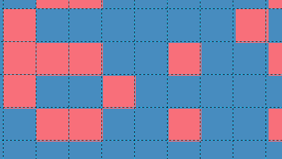
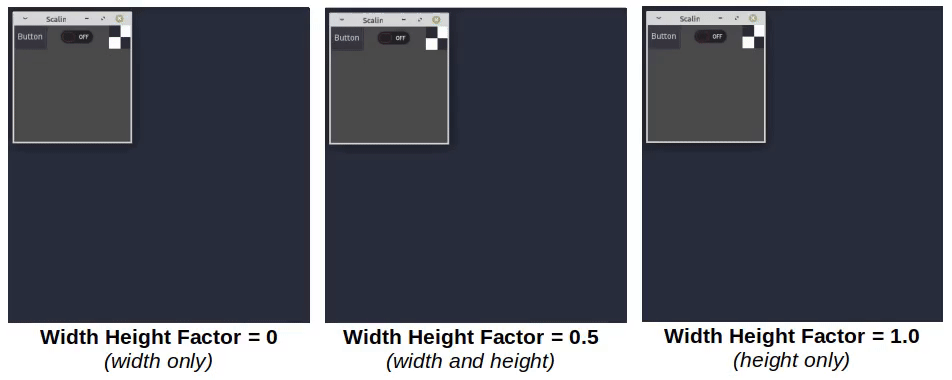

  

<h1 align="center">Scaling CanvasLayer</h1>

This Godot plugin provides a custom [`CanvasLayer`](https://docs.godotengine.org/en/stable/classes/class_canvaslayer.html) that scales the viewport contents to always cover the full window with no black bars, no content reveal, and no distortions. Child [`CanvasItem`](https://docs.godotengine.org/en/stable/classes/class_canvasitem.html) nodes (i.e., UI) can also be scaled, independently of the content.

## Purpose

As noted in the [Godot docs](https://docs.godotengine.org/en/stable/tutorials/viewports/multiple_resolutions.html#the-problem-of-multiple-resolutions), scaling content for multiple resolutions is typically an issue that needs to be addressed in 2D games. Godot has [built-in options](https://docs.godotengine.org/en/stable/tutorials/viewports/multiple_resolutions.html#stretch-aspect) to scale 2D  content under **Project Settings > General > Display > Window > Stretch**, but the only way to scale with both no black bars and no content reveal is to use `Aspect: ignore`, which distorts content.

 *Godot's built-in stretch modes for scaling 2D content.*

Black bars are not aesthetic, and prematurely revealing content outside of the viewport might be undesirable for gameplay. **Scaling CanvasLayer** presents one possible solution, which is always adjusting the zoom such that all black bars and content reveal areas are outside of the viewport's bounds.

 *__Scaling CanvasLayer__ stretches with no black bars, no content reveal, and no distortions.*

## Installation

[Download](https://github.com/nyanginator/godot-scaling-canvas-layer/archive/master.zip) or clone this project and copy `addons/scaling_canvas_layer/` to your project's `addons/` folder. Alternatively you can install using the **AssetLib** from the Godot editor. Search for this plugin and then click **Download** followed by **Install**.

Open your project in Godot and enable **Scaling CanvasLayer** under **Project Settings > Plugins**.

## Usage

 *Script settings.*

Add a **ScalingCanvasLayer** to your scene and then review the settings below.

- **Stretch Shrink** - Sets Godot's [Stretch Shrink](https://docs.godotengine.org/en/stable/tutorials/viewports/multiple_resolutions.html#stretch-shrink) factor. It is an overall scaling factor applied on top of everything. This affects both content and UI.
- **Scale Content** - Toggle content scaling on/off. "Content" is defined as objects that are not *CanvasItem* children of this *CanvasLayer*.
- **Content Desired Resolution** - Specify the ideal resolution of the content here. It determines when to scale up or down. If set to 0x0, the project's window size is used instead.
- **Camera Path** - A camera is required for content scaling. Godot currently doesn't support [getting the active 2D camera by script](https://github.com/godotengine/godot/pull/38317), so you must assign it here manually.
- **Scale Ui** - Toggle UI scaling on/off. "UI" is defined as *CanvasItem* objects that are children of this *CanvasLayer*.
- **Ui Desired Resolution** - Specify the ideal resolution of the UI here. It determines when to scale up or down. If set to 0x0, the project's window size is used instead.
- **Ui Width Height Factor** - Weight factor that determines how much to scale the UI according to width and how much according to height (0.0 = width, 1.0 = height).

## Content Scaling

Content scaling affects objects in the viewport that are not child *CanvasItem* objects. To illustrate how content scaling works, we will be using:

- This 16x9 image: .
- An initial window size of 16x9, set in  **Project Settings > General > Display > Window > Size**.

Content scaling is achieved by scaling the assigned camera's zoom. The resulting effect mimics Godot's `2d` stretch mode, so antialiasing will occur when we scale up.

 *Antialiased content scaling.*

You can avoid antialiasing by disabling **Filter** and **Mipmaps** on the **Import** tab of each asset and then reimporting. Now the results are similar to Godot's `viewport` stretch mode.

 *Disable **Filter** and **Mipmaps** on assets to remove antialiasing.*

However, scaled pixels are not guaranteed to stay square because camera zooming allows pixel fraction in calculations, which occur when the scaled window's aspect ratio is not equal to the desired resolution's aspect ratio. This means that scaled pixels will not align correctly with the pixel grid.

 *Scaling content by camera zoom does not respect the pixel grid.*

If you need pixel-perfect scaling, consider this [solution by sysharm](https://godotengine.org/qa/25504/pixel-perfect-scaling#a26997) or this [plugin by Yukitty](https://github.com/Yukitty/godot-addon-integer_resolution_handler), which scale the viewport instead of the camera zoom.

## UI Scaling

UI scaling affects objects that are child *CanvasItem* objects (i.e., buttons, text, controls) of this *CanvasLayer*. Because UI scaling has its own desired resolution setting, UI objects are scaled independently of the content. In addition, it uses the **Ui Width Height Factor** to determine how much influence the width and height should each have on the final scale. Setting it to 0.0 means only the difference in width (i.e., current resolution vs. desired resolution) will be considered. Setting it to 1.0 means only the difference in height is. A value of 0.5 factors in both width and height equally.

 *Scaling the UI with different **Ui Width Height Factor** values.*

## Further Information

- This plugin overrides the settings under **Project Settings > General > Display > Window > Stretch**.
- Integer scaling (i.e., pixel-perfect scaling) is being discussed in [Godot proposals](https://github.com/godotengine/godot-proposals/issues/1666).

## Credits

- Original content scaling code is based on a [gist by BarelyAliveMau5](https://gist.github.com/BarelyAliveMau5/2ff2d83566e6db63b4f6f782ef46e2bc).
- "16:9" animations of built-in stretch modes are from the [Godot docs](https://docs.godotengine.org/en/stable/tutorials/viewports/multiple_resolutions.html#stretch-aspect). 16x9 image used in the content scaling examples was recreated based on these animations.
- Icon is a modified version of `CanvasLayer.svg` from Godot's [editor icons](https://github.com/godotengine/godot/tree/master/editor/icons).

## License

Copyright © 2021 Nicholas Yang  
Copyright © 2021 BarelyAliveMau5

Unless otherwise specified, files in this repository are licensed under the MIT license. See [LICENSE.md](LICENSE.md) for more information.

